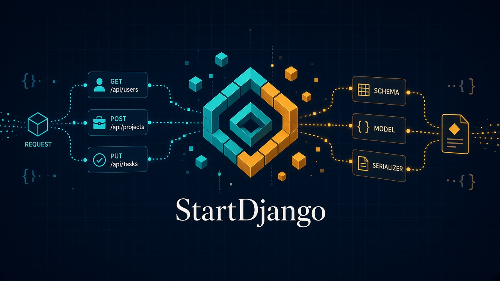
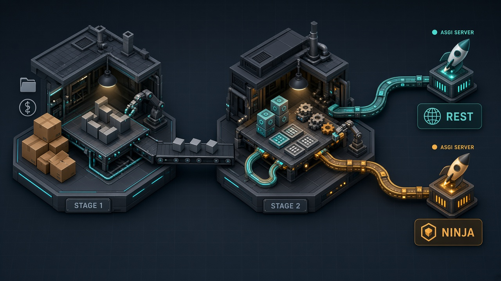
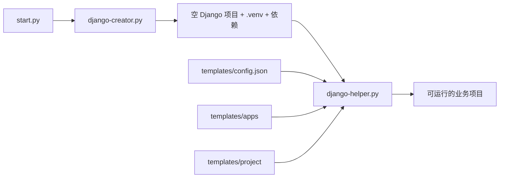

# StartDjango



Django 项目脚手架。选定 API 栈后，一键生成带认证、文档和公共工具的可运行项目。

提供两套彼此独立的生成器：


| 目录         | 栈                                               | 适合                            |
| ---------- | ----------------------------------------------- | ----------------------------- |
| `drf版本/`   | Django REST Framework + SimpleJWT + Spectacular | 需要 Swagger / ReDoc 的 REST API |
| `ninja版本/` | Django Ninja Extra + Ninja JWT                  | Schema 驱动、内置文档的 Ninja API     |


`django startproject` 只能交出空壳：没有 apps 分层、没有 JWT、没有统一响应、没有文档、启动方式也还是同步的 `runserver`。StartDjango 把这些反复要做的事收成一套可改的模板，生成出来就能继续写业务。

## 它在解决什么

日常搭 Django API 时，真正耗时间的往往不是业务，而是同一套基建：

- 虚拟环境、依赖、`startproject` 要手工走一遍
- `apps.accounts` / `apps.common`、JWT、验证码、CORS、后台美化每次都要重配
- 项目骨架如果写死在 Python 字符串里，改一个 views 就要翻脚本
- Django 自带的 `runserver` 是同步 WSGI，和 Ninja / ASGI、以及后面的部署方式对不上

所以工具拆成两步，骨架交给模板，启动则统一走 uvicorn 的 ASGI：

1. **创建与优化分离**：`django-creator.py` 只负责目录、`.venv`、依赖和空项目；`django-helper.py` 再按 `templates/` 注入 apps 和配置。
2. **模板驱动，而不是脚本硬编码**：改生成结果去改 `templates/`，不必改生成器本身。
3. **两套栈互不干扰**：DRF 和 Ninja 各自带依赖、模板和说明，选一个目录运行即可。
4. **开发和部署用同一条启动命令**：模板里带了 `python manage.py server`，底层是 uvicorn，不再用同步 `runserver`。



## 架构逻辑

生成器本身不是 Django 项目，而是「工厂」。一次创建的路径是：




- `start.py` **/** `start.bat`：问项目名、路径、要不要虚拟环境，再按顺序调用后面两个脚本。
- `django-creator.py`：校验名称，创建目录，用 **uv**（或 pip）装依赖，执行 `django startproject`。
- `django-helper.py`：读 `templates/config.json`，拷贝 app 模板，合并或覆盖 `settings.py` / `urls.py`。
- `templates/`：真正的产品形态。`apps/` 是应用骨架，`project/` 是路由和配置模板。

仓库结构：

```
StartDjango/
├── drf版本/                 # REST Framework 生成器
│   ├── start.py
│   ├── django-creator.py
│   ├── django-helper.py
│   └── templates/
└── ninja版本/               # Ninja Extra 生成器
    ├── start.py
    ├── django-creator.py
    ├── django-helper.py
    └── templates/
        └── apps/
            ├── accounts/    # 认证、验证码、JWT
            └── common/      # 模型基类、响应、中间件、启动命令
```

生成出来的项目大致是：

```
myproject/
├── .venv/
├── apps/
│   ├── accounts/
│   └── common/
│       └── management/commands/server.py   # ASGI 启动入口
├── media/  static/  templates/  logs/
├── myproject/                 # settings / urls / asgi
└── manage.py
```

`accounts` 管登录和令牌，`common` 放各业务都会用到的东西。自定义启动命令就放在 `common` 里，生成完就能用，不用再单独配一份进程管理。

## 环境要求

使用本生成器前，本机必须已安装 **Python**，版本要求：

- **Python >= 3.12**

强烈建议同时安装 **[uv](https://docs.astral.sh/uv/)**。生成器默认用 uv 创建虚拟环境并同步依赖，速度更快，也更稳定。没有 uv 时会回退到 pip。

### 安装 uv（推荐）

Windows（PowerShell）：

```powershell
powershell -ExecutionPolicy ByPass -c "irm https://astral.sh/uv/install.ps1 | iex"
```

macOS / Linux：

```bash
curl -LsSf https://astral.sh/uv/install.sh | sh
```

安装后确认：

```bash
python --version    # 应为 3.12 或更高
uv --version
```


## 快速开始

克隆后进入对应栈目录再运行，不要在仓库根目录启动。

```bash
git clone https://github.com/Star-yb/StartDjango.git
cd StartDjango
```

**DRF：**

```bash
cd drf版本
python start.py
```

**Ninja：**

```bash
cd ninja版本
python start.py
```

Windows 也可以运行对应目录下的 `start.bat`。

按提示填写项目名称、路径、是否创建虚拟环境即可。命令行示例：

```bash
python start.py myproject
python start.py myproject D:\projects
python start.py myproject --no-venv
```


## 生成流程

1. `django-creator.py` 创建 Django 项目、`.venv`，并用 uv（或 pip）安装依赖
2. `django-helper.py` 按 `templates/` 写入 apps、settings、urls

各栈的模板、端点和启动方式见：

- [drf版本/README.md](drf版本/README.md)
- [ninja版本/README.md](ninja版本/README.md)


## 项目名称

生成时会校验名称：不能是 Python 关键字、不能与内置模块同名、只能包含字母数字和下划线/连字符、不能以数字开头。推荐如 `my_project`、`api_server`。

## 启动项目

生成结果里带有自定义管理命令 `server`，文件在：

`apps/common/management/commands/server.py`

它用 **uvicorn** 拉起 Django 的 **ASGI** 应用（`<project>.asgi:application`），而不是 `manage.py runserver` 那条同步 WSGI 路径。开发和部署都可以用这一条命令，不必再换一套启动脚本。

创建完成后：

```bash
cd myproject
source .venv/bin/activate      # Linux / macOS
.venv\Scripts\activate         # Windows

python manage.py migrate
python manage.py createsuperuser
python manage.py server
```

默认监听 `http://127.0.0.1:8005`，开发时自动重载。

常用参数：


| 参数                | 默认          | 说明                                                  |
| ----------------- | ----------- | --------------------------------------------------- |
| `--host`          | `127.0.0.1` | 绑定地址，对外服务用 `0.0.0.0`                                |
| `--port`          | `8005`      | 端口                                                  |
| `--reload`        | 启用          | 代码变更后自动重启（开发）                                       |
| `--no-reload`     | —           | 关闭热重载（部署）                                           |
| `--workers`       | `1`         | 工作进程数；热重载只在 `workers=1` 时生效                         |
| `--log-level`     | `info`      | `critical` / `error` / `warning` / `info` / `debug` |
| `--no-access-log` | —           | 关闭访问日志                                              |


开发：

```bash
python manage.py server
python manage.py server --host 127.0.0.1 --port 8005
```

部署时用同一条命令，关掉热重载、打开多进程、绑到公网网卡：

```bash
python manage.py server --host 0.0.0.0 --port 8000 --no-reload --workers 4
```

`runserver` 仍然可用，但生成项目的预期启动方式是 `server`。Ninja 和异步视图都走 ASGI，和后面上线的进程模型也一致。

## 最后

如果 StartDjango 对你有帮助的话，欢迎 Star 或提 Issue。

有条件的小伙伴可以支持一下，请我喝杯奶茶，十分感谢


有问题、建议或想一起改模板，欢迎直接联系。

- **GitHub**：[Star-yb](https://github.com/Star-yb)
- **邮箱**：[starloongyibao@qq.com](mailto:starloongyibao@qq.com)
- **相关项目**：[StarWeb](https://github.com/Star-yb/StarWeb)（FastAPI）、[Star-Go](https://github.com/Star-yb/Star-Go)（Gin）


## License

MIT
